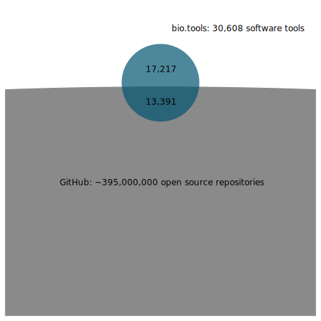
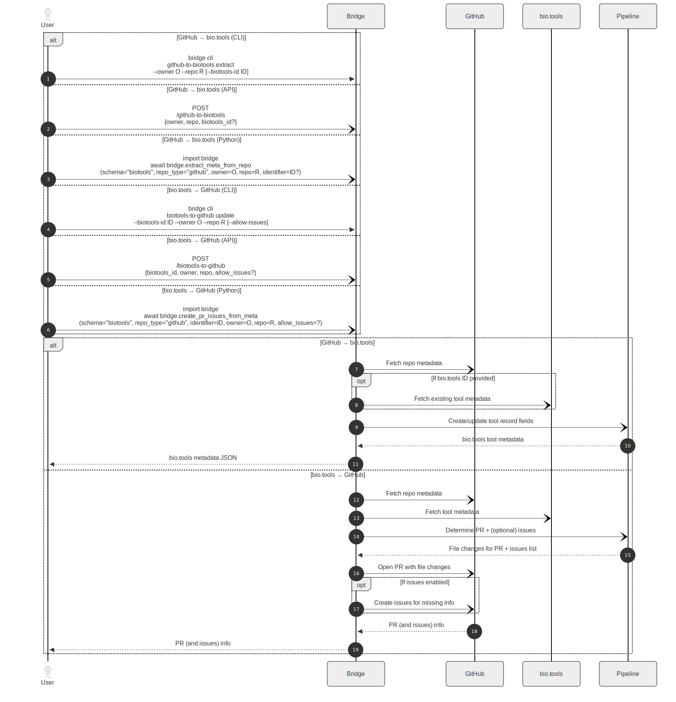

# Abstract

Research software metadata can be found across many code repositories and software registries. Here, we describe the tooling for a bidirectional bridge between the software development platform GitHub and the ELIXIR bio.tools registry of life sciences software tools and data resources. The developed bridge maps and improves metadata records across these two platforms, thereby benefiting both and helping make research software more FAIR: findable, accessible, interoperable, and reusable. Specifically, the bridge enables production of high-quality, rich bio.tools entries from the content already available in GitHub repositories, and uses bio.tools records to suggest improvements to GitHub repositories through pull requests or issues. This includes adding missing information and standardized descriptions for increased compliance with Software Management Plans. The bidirectional bridge makes extensive use of existing APIs (GitHub, bio.tools, Europe PMC) and large language models (LLMs) to enrich metadata on both platforms. By automating metadata extraction, improvement suggestion, and integration, the bridge reduces the manual overhead required to FAIRify research software, lowering barriers for researchers to contribute or maintain well-annotated, reusable software.

# Introduction

[bio.tools](https://bio.tools/) [@Ison2016;@Ison2019] is a curated registry designed to support the discovery, annotation, and interoperability of bioinformatics software and databases. By offering persistent identifiers, bio.tools enhances the findability and reusability of computational resources in line with FAIR principles [@Wilkinson2016;@Barker2022]. The registry also offers the opportunity to add rich and standardized metadata to entries, including EDAM ontology concepts [@Ison2013;@Lamothe2022]. A given registry entry can therefore describe general information (e.g., software name, homepage), contextual metadata (e.g., topic area, publications), software functions (i.e., operations), inputs, and outputs. To ensure semantic consistency and machine readability, the bio.tools metadata follows its own schema: *biotoolsSchema* [@Ison2021].  
The platform serves as a community-driven "hub" that links software curators, developers and users with repositories and complementary infrastructures such as Galaxy [@GalaxyCommunity2024], OpenEBench [@Capella-Gutierrez2017], and WorkflowHub [@Gustafsson2025]. Through these functions, bio.tools acts as a central resource for organizing and connecting the bioinformatics software ecosystem, promoting transparency, interoperability, and sustainable reuse in the life sciences.

[GitHub](https://github.com/) is the leading Git repository hosting service and collaborative platform for software development, hosting almost 400 million public, open-source software repositories [@GitHubStaff2025]. Using Git as the underlying software, it provides transparent and versioned tracking of code development, which enhances reproducibility, accountability, and traceability in collaborative scientific software projects.
GitHub supports software-engineering best practices with features such as pull requests for *structured project contributions and peer review*, issues for *communication around specific features, bugs, or tasks*, and discussion threads for *general communication*.
These features enable controlled collaboration, systematic review, and well‑documented development processes. As a socio-technical infrastructure, GitHub also supports documentation, dissemination, and maintenance of research software [@Braga2022;@Chen2025].  
GitHub can promote FAIR [@Barker2022;@DelPico2024] and Open Science [@UNESCO2021] practices. Public repositories combined with open licenses can provide open access to source code, documentation, and related materials. Integration with scholarly tools such as [Zenodo](https://zenodo.org/), [Open Science Framework (OSF)](https://osf.io/), or [Software Heritage](https://www.softwareheritage.org/) [@dicosmo2017] allows code to be archived, assigned persistent identifiers, and cited. Continuous integration systems support reproducibility by enabling automated testing and verification. Additionally, GitHub's accessibility and community norms support both training and capacity building in reproducible research methods.
Collectively, these features position GitHub as a foundational platform for open, transparent, and sustainable research software development across disciplines.

As a registry, bio.tools makes software more FAIR by supporting a faithful representation of the development repository (e.g., GitHub repository) and providing opportunities to further enrich and build upon the contextual information available for software.   Herein, we describe the construction and implementation of a bidirectional bridge framework that allows for synchronisation between GitHub software repositories and their respective bio.tools entries. This project builds on previous work [@Szmigiel2025] and addresses key barriers to maintaining software metadata. It supports FAIR practices by embedding curation directly into existing workflows. By automating the extraction of metadata, the generation of improvement suggestions and the integration process, the bridge reduces the manual overhead to make research software FAIR, and lowers the barrier to contributing well-annotated, reusable tools.

# Elements of the bidirectional bridge

## GitHub $\rightarrow$ bio.tools

The bridge uses the GitHub API to extract and distil metadata (i.e., tool name, programming languages, license, publications) from a set of example repositories and produces a bio.tools-compatible metadata file that can enrich bio.tools entries (see **Figure 1**). This approach is beneficial because it semi-automates the update of a registry entry, including the addition of rich metadata, and simultaneously reduces the maintenance burden for RSEs while streamlining the path to FAIR software.

## bio.tools $\rightarrow$ GitHub

The bridge also uses bio.tools entry metadata to automatically suggest enhancements to GitHub repositories via issues, where possible. This approach is beneficial because it allows curated entry information from bio.tools to enrich the original source repository for software, adding missing metadata where needed.

# Results

## Repository & registry statistics

At the end of the BioHackathon week (November 7, 2025), there were 30,608 resources described in bio.tools. Of these, 13,774 or 45.0% of entries had at least one GitHub URL. Of these, 13,391, or 97.2% of all entries with GitHub URLs, pointed to a valid public GitHub repository. From these GitHub repositories, the descriptions, GitHub topics, licenses, README.md files, CITATION.cff files and quantitative metrics related to maturity were fetched.

According to the GitHub “Octoverse 2025” report [@GitHubStaff2025], there were approximately 395 million public and open-source repositories in GitHub in October 2025. The share of GitHub repositories covered by bio.tools is thus vanishingly small (see **Figure 2**). Even for a scientific topic such as "machine learning", there are 166,684 GitHub repos matching the GitHub topic, compared to 3,421 tools in bio.tools with the corresponding EDAM topic.

## Metadata maturity

The correlation between software metadata in GitHub and bio.tools maturity level is rather poor. The principal component analysis (PCA) in **Figure 3** illustrates the relationship between maturity-related metrics in GitHub and the *maturity* in the corresponding bio.tools entry. All of these GitHub metrics are highly correlated. For example, a project with more contributors and subscribers is also likely to have more forks, commits, and pulls: this is not surprising.  
While there is some separation between *Emerging* and *Mature* tools, the main suggestion from these results is that a fair number of *Emerging* tools should probably be updated to *Mature*. The first principal component has nearly equal loadings for all metrics, where as the second seizes on the average time to close issues and number of contributors, with *Mature* tools on average having shorter issue closing times and a larger numbers of contributors.  
Of all bio.tools entries 611 are labeled as *Emerging*, 3,532 as *Mature* and 120 as *Legacy*, with 26,345 having no indicated maturity level. Out of the bio.tools entries with valid GitHub repos, 1,386 tools are labeled as *Mature*, 339 as *Emerging* and 18 as *Legacy*.

## Implementation of bridge framework

The bridge framework is implemented in Python that can operate as one of the following:

* A command-line tool,
* An API, or
* A Python package.

In each mode, the exposed core logic is the same. All three entry points call the same internal orchestration layer, so the difference is in packaging only, not implementation.

### High-level overview

Conceptually, the bridge performs similar steps in both directions:

1. **Fetch information from external sources** (i.e. Github files, GitHub metadata, and/or bio.tools metadata) using the corresponding services' APIs.
2. **Build internal representations** of the fetched information, resulting in a GitHub model and a bio.tools model (*if available*).
3. **Map between the two representations** using a direction-specific mapping pipeline.
4. **Produce actionable outputs**:
    1. **GitHub → bio.tools**: produce a bio.tools-compatible metadata JSON that can be used to create/update entries.
    2. **bio.tools → GitHub**: produce repository improvements as (a) file changes in a pull request and (optionally) (b) issues for items that cannot be updated through a pull request.

**Figure 4** demonstrates a summarized sequence diagram of the bidirectional bridge flow from a user perspective. It emphasizes three deliberate design choices:

* A single shared core used by all entry points,
* Explicit separation of workflows for metadata composition and mapping, and
* Specific outputs for each direction of information flow.

### Software architecture

The bridge follows a hexagonal (ports-and-adapters) architecture to keep the mapping logic independent of how it is invoked (e.g. CLI, API, package) and how it communicates with external systems (e.g. GitHub, bio.tools, Europe PMC, SPDX, LLM). The separation enables the implementation to be testable, extensible, and independent of any specific platform or interface.

Separation of concerns in the bridge:

* **User interaction** (*adapters*): The sole purpose of the adapters and entry points is to facilitate access to the bridge. They parse CLI arguments, HTTP requests, or Python function calls and thereby translate user intent into a structured "goal" and parameters. The adapters never implement metadata logic, mapping rules, or repository changes.
* **Canonical internal models** (*core*): The core models define the internal structures of the bridge. They represent GitHub repositories, bio.tools records, licenses, and publications in a normalized form. All of the mapping and decision logic operates on these models rather than the raw API responses. The core models deliberately exclude any knowledge of where the data came from or how it will be written back.
* **External services** (*services*): Services provide access to external systems and APIs. They fetch metadata from GitHub, bio.tools, Europe PMC, and SPDX, returning raw or lightly structured data for composition into the core models. Services also execute repository-level actions (e.g. clone, push, pull request, issue creation). They execute a plan produced by the pipelines, but never modify that plan. They also include optional services that provide assistive capabilities, such as LLMs.
* **Model composition** (*builders*): Builders implement an ingest–transform–compose pattern for relevant services that converts raw external data into validated core models. They provide a boundary between services and mapping logic.
* **Use-case composition** (*bootstrap*): The bootstrap layer declares which repository types, metadata schemas, and goals are supported, and wires together the corresponding handlers, builders, and pipelines. It defines what combinations are allowed, but not how they are executed.
* **Use-case orchestration** (*handlers*): Handlers implement the high-level workflows for each goal (GitHub → bio.tools and bio.tools → GitHub). They call builders to construct core models, call the appropriate mapping pipeline, and delegate execution of results to services. Handlers coordinate the process but contain no field-level mapping rules.
* **Mapping logic** (*pipelines*): Pipelines encode direction-specific reconciliation logic for given repository and metadata types. They decide what should change by invoking small, field-specific mapping functions. The output is either a registry-ready tool record or a concrete update plan (PR edits + issues). See more in [Mapping logic](#mapping-logic).
* **Field-level mapping** (*pipelines, map_funcs*): Field-level mapping functions implement transformations for individual concepts such as name, description, license or topics. They handle normalization, cleaning, templating, and comparison, but do not fetch data or apply changes themselves.
* **Cross-cutting infrastructure** (*logging, config*): These layers support everything else without owning domain decisions. They support centralized configuration, authentication tokens, and logging.

## Mapping logic

The core of the bidirectional bridge lies in field-level reconciliation between metadata representations. Because GitHub repositories and bio.tools entries differ substantially in structure, semantics, and completeness guarantees, metadata cannot be transferred through simple one-to-one field mapping. Instead, reconciliation is implemented through explicit decision logic for each metadata concept.

In practice, this logic is realized as direction-specific mapping functions. Each function is responsible for a single field (e.g. name, description, version, homepage, publications) and governed by an explicit reconciliation policy. In this context, the platform from which metadata is read is referred to as the *source* (i.e. GitHub or bio.tools), and the platform being updated is referred to as the *target*. Across both directions, the mapping logic follows a small set of consistent principles:

* **Source-prioritized updates**. For a given field, when a value is present in the *source*, it is treated as authoritative. The mapping function produces a target-compatible representation of this value, which replaces the corresponding field in the *target*.
* **Preservation of missing values**. Absence of a value in the *source* never triggers removal or modification of the corresponding field in the *target*. If the *target* already contains a value, it is preserved unchanged; if the field is missing, it remains absent after mapping.
* **Explicit conflict handling**. When *source* and *target* contain different values, the *source* value takes precedence, as mentioned above. Such cases are explicitly detected and logged, ensuring that potentially meaningful discrepancies are visible to the user rather than silently resolved.
* **Policy-driven behavior**. All reconciliation decisions are governed by explicit, field-level rules encoded in the mapping functions. No heuristic or implicit behavior is applied outside these rules, making the mapping logic predictable.

**Figures 5-6** illustrate a selection of mapping functions as flowcharts. The figures highlight how source prioritization and explicit conflict handling are applied, without requiring inspection of the implementation code. More process-related diagrams and flowcharts can be accessed in the [documentation](https://bio-tools.github.io/biohackathon2025/api_reference/diagrams_dev.html).

# Discussion 

The goal of this BioHackathon project was to make software metadata annotation and maintenance less painful by creating a mechanism that can extract high-quality metadata from GitHub repositories to build bio.tools entries, and use bio.tools records to propose improvements back to GitHub (i.e., badges, descriptions, files). The outcome was a bidirectional bridge for maintaining software metadata, the structure of which has been designed to be a sustainable (i.e., extensible and robust) contribution to the global FAIR software ecosystem: capable of supporting bio.tools to faithfully represent GitHub repositories for software, while affording the possibility for developers and registry curators to leverage bio.tools and its underlying standards to improve the metadata richness of software repositories.

The process of building and testing the bridge also revealed a number of insights.

**Statistics:** the repository and registry statistics collected showed that there is a vast gulf between the number of open-source repositories on GitHub and the number of bio.tools entries. The example of machine learning is illustrative of this challenge. Those repositories which fall within this domain, and that also contain software, could benefit from the bidirectional bridge facilitating the creation of new bio.tools entries. In such an example, the new entries could be reviewed, the bio.tools metadata wizard could support enrichment of the entry, and the enriched metadata could be passed back to the GitHub repository. There is also a clear need to expand the reach of the bio.tools registry, registering new software based on the respective repositories to make more of the global ecosystem FAIR.

**Completeness of metadata:** the results of comparisons between GitHub and bio.tools metadata underscore the importance of bridging and where possible synchronising metadata. The core reasons for this are to faithfully represent a repository in the registry that is intending to facilitate FAIRness, and to ensure that there are software creators are aware of bio.tools, and can leverage the registry to address metadata completeness. This aspect also requires engagement with the broader community, not only to make them more aware of bio.tools and the bridge, but to actively incorporate their requirements and use cases into their iterative development. 

**Mapping challenges:** it was found to be harder than expected to transfer multiple topics from bio.tools to GitHub. We also observed that while there is a correlation between GitHub-derived metrics and the curated maturity level in bio.tools, the utility of automatically suggesting a maturity level based on the GitHub metrics may be limited to suggesting the "legacy" level for archived repositories.

# Conclusion & future work

The bidirectional bridge connects a commonly used software development platform (GitHub) with the life sciences tool registry bio.tools. The bridge reduces the amount of manual work required for software metadata curation, uses bio.tools to improve the visibility and discoverability of repositories, and closes the loop by establishing the first synchronisations of metadata between GitHub and bio.tools. Metadata is useful in both directions.

The project has delivered a successful bridge mechanism concept: there is now a suite of additional downstream work that may be undertaken to realise the full potential of the bridge.

Firstly, the underlying framework of the bridge has been designed following a modular and scalable approach. This will enable further work to connect additional development platforms (e.g., [GitLab](https://about.gitlab.com/), [Codeberg](https://codeberg.org/)), or registries (e.g., [Research Software Directory](https://research-software-directory.org/)), by adding suitable metadata schema mappings. Other extension possibilities may include language or framework specific mappings (e.g. [Bioconda](https://bioconda.github.io/), [Bioconductor](https://www.bioconductor.org/)). As both GitHub and bio.tools evolve independently, it will also be important to regularly and automatically test that the bridge is still traversible.

Secondly, there are multiple enhancements being discussed to support the bridge, including a Pub2Tools integration for metadata mining, integration of the bridge into the bio.tools user interface, as well as suitable processes for mapping EDAM topics from GitHub to bio.tools, and mapping bio.tools functions to a GitHub README.

Finally, to ensure that the continued evolution of the bridge meets the expectations of the research software community, additional repositories will need to be recruited for testing, and processes will be established to collect and prioritise the requirements of bridge end users.

# GitHub repository and data repositories

* GitHub repository: https://github.com/bio-tools/biohackathon2025

# Acknowledgements

The authors acknowledge the ELIXIR and all organizers and participants of ELIXIR BioHackathon Europe 2025 in Berlin, Germany, for helping make this project a success. We particularly thank those participants who contributed their GitHub repositories or bio.tools entries for testing of the bidirectional GitHub $\rightleftarrows$ bio.tools bridge. Participation in the BioHackathon was in part supported by the TDCC-LSH project "FAIR tool framework" (M.P., M.S.-T.).

# References
